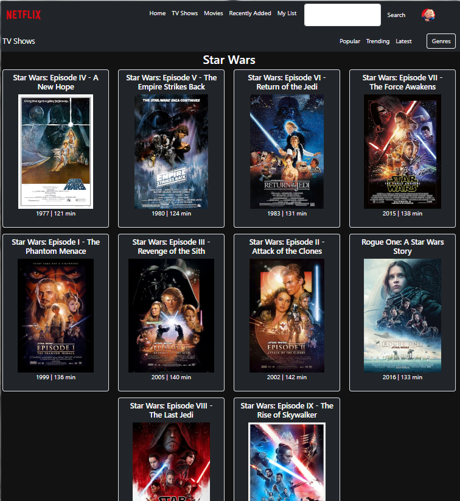

<!DOCTYPE html>
<html lang="it">
<head>
  <meta charset="UTF-8">
  <meta name="viewport" content="width=device-width, initial-scale=1.0">
  
</head>
<body style="font-family: Arial, sans-serif; background-color: #121212; color: white; padding: 20px;">

  <h1>📽️ Netschifo</h1>

  
Un'applicazione React che permette di visualizzare informazioni sui film, tra cui titoli, locandine e durata, utilizzando l'API di OMDB (Open Movie Database). In questo caso, i film sono cercati tramite il nome "Star Wars". 🛸✨

  <h2>🚀 Funzionalità principali</h2>
  <ul>
    <li>🔍 <strong>Ricerca dei film</strong> per nome (in questo caso, "Star Wars").</li>
    <li>🎬 <strong>Visualizzazione delle locandine</strong> dei film.</li>
    <li>📅 <strong>Visualizzazione dell'anno di uscita</strong> e della <strong>durata</strong> del film.</li>
    <li>💬 <strong>Gestione degli errori</strong> e visualizzazione di uno <strong>spinner</strong> durante il caricamento dei dati.</li>
  </ul>

  <h2>🖥️ Tecnologie utilizzate</h2>
  <ul>
    <li><strong>React</strong>: per creare l'interfaccia utente dinamica.</li>
    <li><strong>React Bootstrap</strong>: per il layout e i componenti di UI.</li>
    <li><strong>OMDB API</strong>: per ottenere informazioni sui film.</li>
  </ul>

  <h2>📡 Setup e Installazione</h2>
  
Per avviare l'applicazione, segui questi passaggi:

  <ol>
    <li><strong>Clona il repository:</strong>
      <pre><code>git clone https://github.com/M4nU3l4/Netschifo.git</code></pre>
    </li>
    <li><strong>Installa le dipendenze:</strong>
      
Naviga nella cartella del progetto ed esegui:

      <pre><code>cd Netschifo
npm install</code></pre>
    </li>
    <li><strong>Avvia l'applicazione:</strong>
      
Esegui il comando seguente per avviare il server di sviluppo:

      <pre><code>npm start</code></pre>
      
L'app sarà disponibile su <a href="http://localhost:5173" target="_blank">http://localhost:5173</a> nel tuo browser.

    </li>
  </ol>

  <h2>🛠️ API utilizzata</h2>
  
Questa applicazione utilizza l'API di <a href="http://www.omdbapi.com/" target="_blank">OMDB</a>, che fornisce informazioni su film e serie TV. È necessaria una <strong>chiave API</strong> per effettuare le richieste.

  <h3>URL di esempio:</h3>
  <pre><code>https://www.omdbapi.com/?apikey=f15a86c1&s=Star%20Wars</code></pre>

  <h2>📸 Screenshot</h2>
  
Ecco un esempio di come appare l'applicazione:

  

  <h2>🔄 Possibili miglioramenti</h2>
  <ul>
    <li>💬 <strong>Aggiungere un campo di ricerca</strong> per permettere all'utente di cercare film personalizzati.</li>
    <li>🎥 <strong>Aggiungere funzionalità per la visualizzazione dei dettagli</strong> di ogni singolo film (trama, attori, ecc.).</li>
    <li>🌙 <strong>Migliorare la gestione degli errori</strong> e aggiungere messaggi più dettagliati in caso di fallimento delle richieste.</li>
  </ul>

  <h2>💬 Contributi</h2>
  
Se desideri contribuire a questo progetto, fai un fork del repository, crea una nuova branch per le tue modifiche e invia una pull request!

  <h2>🧑‍💻<strong>Autore</strong></h2>
  
Manuela Lissia

   
  

  <footer>
    
🚀 Buona visione dei film! 🍿

  </footer>
</body>
</html>

